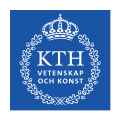
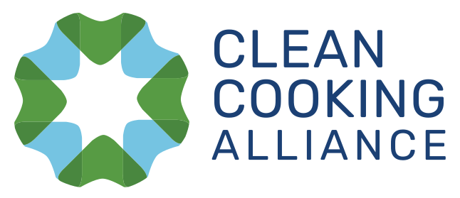
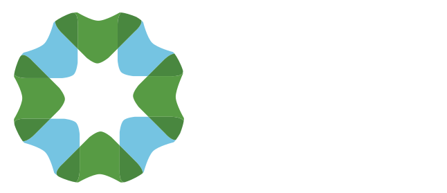

*************************
Contributors and Partners
*************************

Contributors
************
* Camilo Ramirez https://github.com/camiloramirezgo
* Babak Khavari https://github.com/babakkhavari
* Alicia Oberholzer https://github.com/aliciaoberholzer
* Marc Jeuland https://nicholas.duke.edu/people/faculty/jeuland
* Francesco Fuso Nerini https://www.kth.se/profile/ffn
* Dilip Khatiwata https://www.kth.se/profile/dilipk

Partners
********

