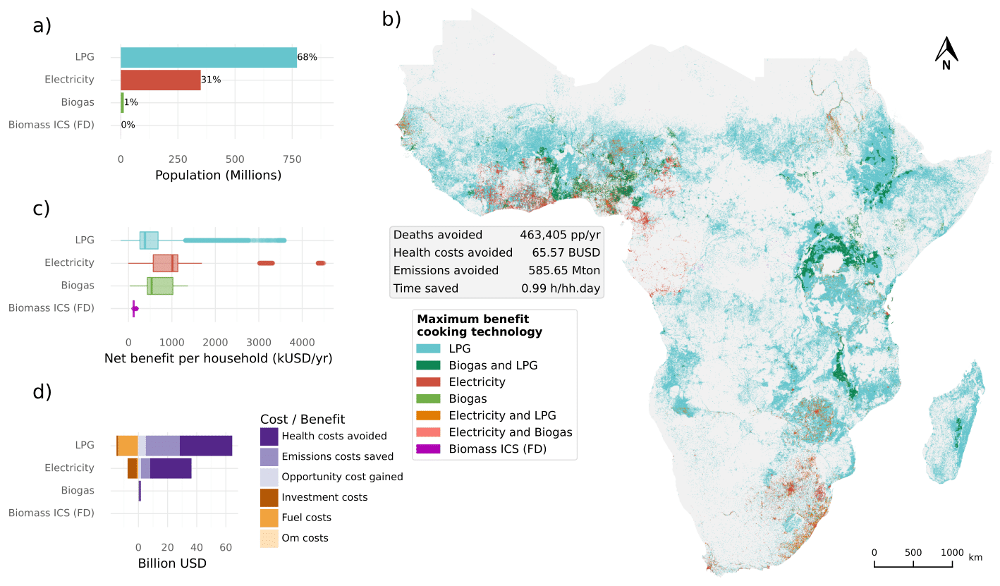

****************
The OnStove Model
****************
OnStove determines the net-benefit of different stoves relative to a stated base-line. Net-benefit is in this case defined as all the benefits minus all the costs. The benefits include: reduced morbidity, reduced mortality, reduced emissions and time saved. The costs include: capital costs, fuel costs as well as operational and maintenance (O&M) costs. The tool has four distinct modules, GIS-processing, baseline calibration, net-benefit calculation and visualization. Each one of these modules are described in more detail below.

OnStove
#######

GIS data processing
*******************
All the GIS-processing needed for OnStove is conducted in the tool itself. This part of the tool only has to be ran once i.e., if you chose to run several scenarios but keep the GIS-data the same, this part does not need to be reran. The tools included in the GIS-processing module of OnStove range from simple geoprocessing tools such as clipping and reprojecting, to more complex tools such as least-cost path algorithms. The tools here are developed to accommodate the necessary OnStove workflows and it should not be viewed as a general GIS-processing tool.

.. note::

    For more information on the different geoprocessing tools included in OnStove see the `Layer scripts <https://onstove-documentation.readthedocs.io/en/latest/layers.html>`_.

Baseline calibration
********************
The baseline calibration is a very important step as all of the stoves included in the analysis are compared relative to the baseline, both with regards to costs and benefits. The baseline calibration does four things: calibrates urban and rural population, calibrates total population, calibrates the current stove shares in urban and rural areas and calibrates the electrified population.

Urban-Rural calibration
-----------------------

To estimate which areas are urban and which are rural is an important step, as these areas in many industrializing countries tend to have different electrification and clean cooking rates. This step can be done in two ways in OnStove. The user can either create their own urban-rural calibration based on population density or use an external dataset classifying areas into either urban or rural and use that directly (for this prupose OnStove currently supports the use of the `GHS SMOD dataset <https://ghsl.jrc.ec.europa.eu/download.php?ds=smod>`_.   

.. note::

    See the `GHS calibration <https://onstove-documentation.readthedocs.io/en/latest/generated/onstove.onstove.OnStove.calibrate_urban_rural_split.html#onstove.onstove.OnStove.calibrate_urban_rural_split>`_ and `manual calibration <https://onstove-documentation.readthedocs.io/en/latest/generated/onstove.onstove.OnStove.calibrate_urban_manual.html#onstove.onstove.OnStove.calibrate_urban_manual>`_ for more information on the GHS and manual calibration respectively.

Population calibration
----------------------

The population calibration is important as in many instances the geospatial population datasets do not match the total current population. The calibration is carried out across the entire region in order to ensure that the population in the study area matches the value given in the socio-economic file.

.. note::

    For more information on the population calibration see the `Calibrate current pop <https://onstove-documentation.readthedocs.io/en/latest/generated/onstove.onstove.OnStove.calibrate_current_pop.html#onstove.onstove.OnStove.calibrate_current_pop>`_.

Current stove-share calibration
-------------------------------

All benefits and costs are relative to the baseline stove calibration. In the technical specs the user enters the urban and rural shares of all stoves that are included in the baseline. All stoves that you wish to include in the calibration need to have the parameters “current_share_rural” and “current_share_urban”. If these two parameters do not exist for a stove it will not be included in the baseline (they will be assumed to have a share of 0). Note that you do not need to include a stove in the baseline in order to have it as an option in the net-benefit equation (i.e., you can still model e.g., biogas stoves without having any biogas stoves in currently in the baseline). Each stove can also have an “is_base” parameter. This parameter is set to “False” as default, but if it is added in the techno-economic specs as “True” for any stove, everyone in the baseline will cook with this one type of stove (in both urban and rural settlements).

.. note::

    The current stove shares sets the base values to which all benefits and costs are compared, see `set base fuel <https://onstove-documentation.readthedocs.io/en/latest/generated/onstove.onstove.OnStove.set_base_fuel.html#onstove.onstove.OnStove.set_base_fuel>`_.

Current electrification calibration
-----------------------------------

The current electrification rate is calibrated using a Multi-Criteria Analysis (MCA). The criteria used is population density, nighttime light intensity and proximity to electricity related infrastructure. The electricity infrastructure used is firstly transformers if available, then medium-voltage lines and lastly high-voltage lines. The default is to use equal weights for the three factors included in the calibration, but this can be altered using the socio-economic specification file (using pop_weight, NTL_weight and infra_weight respectively). The electrification calibration is done to ensure that national, urban and rural electrification rates match the values as entered by the user in the socio-economic file. The electrification calibration results in fully, partly, and non-electrified settlements. Note that OnStove does not assume an expansion of electricity access i.e., whoever has electricity access currently can cook with electricity and whoever does not, can not. In cases where electrical stoves are the stove with the highest net-benefit in areas without electricity access, the stove with the second highest net-benefit will be chosen.     

Net-benefit calculation
***********************
The net-benefit equation uses four benefits (reduced morbidity, reduced mortality, time saved and avoided emissions) as well as three costs (capital cost, fuel cost and Operation and Maintenance (O&M) costs). All benefits are monetized in order to be compared to the costs. The net-benefit is defined as all benefits minus all the costs as outlined in equation 1

.. math::

   \mbox{net-benefit } = (Morb + Mort + Time + Carb) - (Cap + Fuel + O\mbox{&}M)                    \tag{1}

Where; *Morb* is the value of the decrease in morbidity experienced when switching stoves, *Mort* is the value of the decrease in mortality experienced when switching stoves, *Time* is the value of time saved by switching stoves, *Carb* is the value of the decrease in carbon emissions by switching, *Cap* is the capital costs of the stove, *Fuel* is the fuel cost and *O&M* is the operation and maintenance cost of the stove. This is a modified version of a prior net-benefit specification by Jeuland et al. [1]_ Each one of the parameters in equation 1 are explained in their respective sub-sections here. 

Morbidity and Mortality
-----------------------
The morbidity and mortality parameters describe the reduced risk of disease and death from five diseases connected to Household Air Pollution (HAP). These diseases are Lung Cancer (LC), Acute Lower Respiratory Infection (ARLI), Ischemic Heart Disease (IHD), Chronic Obstructive Pulmonary Disease (COPD) and stroke. The HAP is described in terms of 24-h PM\ :sub:`2.5`\-emissions (measured in :math:`\mu` g/m\ :sup:`3`\). Values of PM\ :sub:`2.5`\ can be found in various different sources [2]_ [3]_. In OnStove each stove's 24-h PM\ :sub:`2.5`\-emissions is multiplied by an exposure adjustment factor (:math:`\epsilon`). This factor is meant to capture the fact that people tend to change behaviour when acquiring a new stove. The exposure adjusment factor is 0.71 in OnStove as default, this value is typically used for every stove in the analysis except for traditional biomass (in the first application of OnStove a value of 0.51 was used for traditional biomass). This is in line with the work conducted by Das et al. [2]_ Using the adjusted 24-h PM\ :sub:`2.5`\-emissions of each stove the Relative Risk (RR) of contracting LC, ALRI, IHD, COPD and stroke is calculated based on the relation suggested by Burnett et al. [4]_ (equation 2): 

.. math::
    
    RR = \begin{cases} 
        1, & \mbox{24-h } PM_{2.5}\mbox{-emissions}*\epsilon < z_{rf}
        \\ 1 + \alpha * (1 - \exp(-\beta*(\mbox{24-h } PM_{2.5}\mbox{-emissions}*\epsilon - z_{rf})^\delta)) , & \mbox{24-h } PM_{2.5}\mbox{-emissions}*\epsilon \geq z_{rf}
        \end{cases}

Where; RR is the relative risk associated with each disease studied (LC, IHD, COPD, ALRI and stroke), and :math:`\alpha, \beta, \delta` and z\ :sub:`rf`\ are disease-specific constants determined experimentally. Note that the equation system indicates that when 24-h PM\ :sub:`2.5`\-emissions are under a certain threshold (z\ :sub:`rf`\) there is no increased risk of disease. The constants :math:`\alpha, \beta, \delta` and z\ :sub:`rf`\ were determined for each disease by conducting 1,000 runs per disease. For more information on these constants, see Burnett et al. [4]_ and their `data <http://ghdx.healthdata.org/sites/default/files/record-attached-files/IHME_CRCurve_parameters.csv>`_ (clicking the link will download a csv-file). 

.. note:: 
    The values of :math:`\alpha, \beta, \delta` and z\ :sub:`rf`\ for each disease are hardcoded in OnStove as the averages of the 1,000 runs conducted by Burnett et al. [4]_. See the `relative risk function <https://onstove-documentation.readthedocs.io/en/latest/generated/onstove.technology.Technology.relative_risk.html>`_.

Once the RR is determined, the Population Attributable Fraction (PAF) is calculated based on equation 3. PAF is often used to assess the public health impacts resulting from a population’s exposure to a risk.

.. math::
    
    \frac{sfu*(RR_k - 1)}{sfu*(RR_k - 1) + 1} = PAF_k \tag{3}

Where; sfu (solid-fuel users) is the share of population not using clean cooking currently and RR\ :sub:`k` is the disease-specific RR determined using equation 2. sfu can be found from e.g. the `IEA website <https://www.iea.org/reports/sdg7-data-and-projections/access-to-clean-cooking>`_, tracking SDG 7 [5]_ or Stoner et al. [6]_ 

Using the PAF calculated with equation 3 the reduced number of cases and deaths per disease can be determined using equations 4 and 5. 

.. math::
    Morb_k = Population * (PAF_0 - PAF_i) * IR_k \tag{4}
.. math::
    Mort_k = Population * (PAF_0 - PAF_i) * MR_k \tag{5}

Where; Population is the total population, MR\ :sub:`k` is the mortality rate associated with the disease and IR\ :sub:`k` is the incidence rate associated with the disease, PAF\ :sub:`0` is the PAF-value for the baseline and PAF\ :sub:`i` is the PAF-value of the new stove. Since PAF\ :sub:`0` and PAF\ :sub:`i` are diversified between urban and rural settlements (sfu tends to be different in urban and rural settings), so is Morb\ :sub:`k` and Mort\ :sub:`k`. Note that since OnStove is a raster-based geospatial tool the :math:`population` is on a cell-basis. The MR\ :sub:`k` and IR\ :sub:`k` can be diversified by country for each disease (an example source is the GBD database [7]_).

The number of cases and deaths avoided are translated to monetary value using the Cost of Illness (COI) and Value of Statistical Life (VSL) (see equations 6 and 7). In cost-benefit analysis, the COI is used to quantify the economic consequences of disease or accidents and the VSL is an important valuation concept in cost-benefit studies, as it is often used as a measure for mortality risk reduction. The equations also include a factor for Cessation Lag for each disease (CL\ :sub:`k`). CL\ :sub:`k` is used to capture the fact that the full health-benefit of switching does not appear instantaneously after a stove-switch. 

.. math::
    Morb = \sum_{k} (\sum_{t=1}^{5} CL_k * COI_k * \frac{Morb_k}{(1+\delta)^{t-1}}) \tag{6}
.. math::
    Mort = \sum_{k} (\sum_{t=1}^{5} CL_k * VSL * \frac{Mort_k}{(1+\delta)^{t-1}}) \tag{7}

Where; CL is the cessation lag (as function of disease k and time t), COI is the cost of illness (as function of disease k), VSL is the value of statistical life, Morb\ :sub:`k` is reduced cases (of disease k), Mort\ :sub:`k` is reduced number of deaths (as result of disease k) and \delta is the discount rate. As the calculations of Morb\ :sub:`k` and Mort\ :sub:`k` (equation 4 and 5) are diversified by cell, so is the values of Morb and Mort.  

.. note::

    In OnStove we assume it takes five years for the full benefits to be experienced. The cessation lags for each disease is hard-coded (see the mobidity and mortality functions). See table 1 for the values currently used in OnStove, these values are in accordance to the values used in BAR-HAP [2]_.

    +---------+-------+-------+------+---------+-------+
    | CL      | COPD  | LC    | IHD  | Stroke  | ALRI  |
    +=========+=======+=======+======+=========+=======+
    | Year 1  | 0.3   | 0.2   | 0.2  | 0.2     | 0.7   |
    +---------+-------+-------+------+---------+-------+
    | Year 2  | 0.2   | 0.1   | 0.1  | 0.1     | 0.1   |
    +---------+-------+-------+------+---------+-------+
    | Year 3  | 0.17  | 0.24  | 0.24 | 0.24    | 0.07  |
    +---------+-------+-------+------+---------+-------+
    | Year 4  | 0.17  | 0.23  | 0.23 | 0.23    | 0.07  |
    +---------+-------+-------+------+---------+-------+
    | Year 5  | 0.16  | 0.23  | 0.23 | 0.23    | 0.06  |
    +---------+-------+-------+------+---------+-------+

Time saved
----------
Each stove has an associated cooking time and an associated collection time. The cooking and collection times are both entered in the techno-economic specification file (see the `input data section <https://onstove-documentation.readthedocs.io/en/latest/onstove_tool.html#techno-economic-data>`_). The change in time is monetized using the minimum wage in the study area and a geospatial representation of wealth (this can be either a relative wealth index or a poverty layer see the `GIS data section <https://onstove-documentation.readthedocs.io/en/latest/onstove_tool.html#gis-datasets>`_). Similar to the health-benefits, the time-benefits are relative to the baseline. The fuels used for the biomass and biogas stoves are assumed to be collected by the end-users themselves (functions for this are included in OnStove).

**Biomass**

The biomass stoves (both traditional and improved) rely on biomass collected by the end-users themselves. In the first studies using OnStove it has been assumed that the biomass used is firewood. Therefore, a spatial representation of forest cover is used to estimate the time needed to collect fuel (see the `GIS data section <https://onstove-documentation.readthedocs.io/en/latest/onstove_tool.html#gis-datasets>`_). In addition to the forest layer a walking-only friction layer is used. The friction layer describes the time it takes to travel 1 m by foot through each square kilometer [8]_. A spatial least-cost path (in terms of time) is calculated between each settlement and biomass supply sites. The total time spent collecting biomass for cooking would therefore be the traveltime to the site in addition to time needed at the site for the actual collection (actual collection time is entered in the techno-economic specs file by the user).

**Biogas**

The calculations used for biogas are similar to those for biomass. Biogas is assumed to be produced at a household level by the end-users themselves, who are also the ones collecting the necessary material for its production. In the current version of OnStove manure is assumed to be used to produce biogas. The manure is collected by the households themselves within the square kilometer in which they live. The amount of manure available is estimated with the help of the spatial distribution of livestock (see the `GIS data section <https://onstove-documentation.readthedocs.io/en/latest/onstove_tool.html#gis-datasets>`_), estimates on who much manure each type of animal produces and how much of it can be used for conversion to biogas [9]_. The time needed to collect a sufficient amount of manure is estimated using a walking-only friction layer describing the time it takes to travel 1 m by foot through each square kilometer [8]_. See more information in the documentation of the `biogas class <https://onstove-documentation.readthedocs.io/en/latest/generated/onstove.technology.Biogas.html>`_. 

Emissions avoided
-----------------

The *Carb* parameter in the net-benefit equation (equation 1), refers to the environmental benefits of reducing greenhouse gas (GHG) emissions. Each fuel is assumed to have emissions coupled with its use, and in some cases, its transport and/or production. The value of emissions avoided is calculated using equation 8:

.. math::
    
    Carb = c^{CO_2} * (fueluse_0 * \frac{\gamma_0 * \mu_0}{\epsilon_0} - fueluse_i * \frac{\gamma_i * \mu_i}{\epsilon_i}) \tag{8}

Where; :math:`c^{CO_2}` is the social cost of carbon (USD/tonne) (example source [10]_), :math:`fueluse` is the amount of fuel used for cooking (kWh for electricity, kg for the rest), :math:`\mu` is the energy content of the fuel (MJ/kWh for electricity, MJ/kg for the rest), :math:`\epsilon` is the fuel efficiency of the stove (%), :math:`\gamma` is the carbon intensity of the fuel (kg/GWh for electricity, kg/GJ for the rest) for which five different pollutants (carbon dioxide, methane, carbon monoxide, black carbon and organic carbon) in combination with their 100-year Global Warming Potential (GWP) are used. Subscript :math:`0` denotes the baseline stove combination and, :math:`i` the new stove.

The energy needed to cook a meal is used to estimate :math:`fueluse` for each stove. It is assumed in the current version of OnStove that 3.64 MJ is used to cook a standard meal as outlined by Fuso Nerini et al. [11]_ This value can be changed in onstove.py by changing *self.energy_per_meal* parameter. Using this value, :math:`fueluse` can then be calculated as outlined by equation 9:

.. math::

    \frac{3.64}{\epsilon} *\mu \tag{9}

The carbon intensity :math:`\gamma` of fuel :math:`i`, is calculated according to equation 10.

.. math::
    
    \gamma_i = \sum_{j} \epsilon_{i,j} * GWP_j \tag{10}

Where; Where :math:`\gamma_{(i,j)}` is the emission factor of pollutant :math:`j` of fuel :math:`i` and :math:`GWP_j` the 100-year global warming potential of pollutant :math:`j`.

.. note::

    :math:`\mu`, :math:`\epsilon` and :math:`\gamma` for all stoves except electrical stoves are added in the techno-economic specification file. See fuel specific sections below.

**Biomass**

The carbon emissions caused by the use of woody biomass is dependent on the fraction of Non-Renewable Biomass (fNRB) [12]_. fNRB is defined as the demand of fuelwood that exceeds regrowth in a given area. In the case of biomass equation 10 is modified as outlined in equation 11:

.. math::
    
    \gamma_i = \sum_{j} \epsilon_{i,j} * GWP_j * \psi \mbox{, where } \psi = 1 \mbox{ for } j \neq CO_2  \tag{11}

**Charcoal**

Similar to the case of biomass equation 10 is modified as described in equation 11 when the fuel assessed is charcoal. In addition to this emissions coupled with the production of charcoal are also added to the total emissions. Each kg of charcoal produced is assumed to produce 1,626 g of CO\ :sub:`2`, 255 g of CO, 39.6 g CH\ :sub:`4`, 0.02 g of black carbon and 0.74 g OC [13]_. These values are included in the charcoal class, to change these values refer to the `class <https://onstove-documentation.readthedocs.io/en/latest/generated/onstove.technology.Charcoal.production_emissions.html>`_.

**LPG**

In addition to stove-emissions coupled with LPG-stoves, the transport of LPG is also assumed to produce emissions. These emissions are dependent on the traveltime needed to transport LPG. The time needed to transport LPG to different settlements is coupled with the assumed emissions of light-commercial vehicles (14 l/h) in order to estimate the total diesel consumption needed for transportation. Each kg of diesel used is assumed to produce 1.52 g of PM (black carbon fraction of PM is assumed to be 0.55 and the OC fraction of black carbon is assumed to be 0.7), 3.169 g of CO\ :sub:`2`, 7.4 g of CO and 0.056 g of N\ :sub:`2`\O. To change these values (as well as the diesel consumption per hour) see the `LPG class <https://onstove-documentation.readthedocs.io/en/latest/generated/onstove.technology.LPG.transport_emissions.html>`_.

**Electricity**

The production of electricity is coupled with emissions. These emissions are in turn dependent on the grid electricity mix of the study area. The carbon intensity :math:`\gamma_{grid}` is therefore calculated as the weighted average of the emission factors of the generation technologies, see equation 12.

 .. math::
    
    \gamma_{grid} = \frac{\sum_k \epsilon_k * g_k}{\sum_k g_k} \tag{12}

Where; :math:`\gamma_{grid}` is the CO\ :sub:`2`-equivalent intensity of the grid, :math:`\epsilon_k` is the emission factor of generation technology :math:`k` and :math:`g_k` is the electricity generation of technology :math:`k`.

The user is required to enter the installed capacity and power generated by the different powerplants feeding the grid of the study area in order for this calculation to be possible. The emission factors of different powerplants are given in the `Electricity class <https://onstove-documentation.readthedocs.io/en/latest/generated/onstove.technology.Electricity.html>`_.

.. note::

    For electricity new power plants can be added in the techno-economic specification file. Beware that you then need to add one line for capacity and one for generation (as capacity_X and generation_X, where X is the new powerplant name e.g. capacity_wind and generation_wind). Then, in the electricity class, the dictionary called *carbon_intensities*, * grid_capacity_costs* and * grid_techs_life* need to be added for the new technology. Capacity cost is the cost of adding one kW to the grid with a powerplant of type X and grid_tech_life is powerplants X’s lifetime.

Capital cost
------------

The capital cost represents an upfront cost that a user has to pay in order to use a specific stove. The capital cost used in OnStove is investment cost needed for the stove netting out the salvage cost as described in equation 13.

.. math::

    \mbox{Capital cost } = \mbox{ Investment cost } - \mbox{ Salvage cost} \tag{13}

The salvage cost assumes a straight-line deprecation of the stove value as described in equation 14.

.. math::

    \mbox{Salvage cost } = inv * (1 - \frac{\mbox{used life}}{\mbox{technology life}}) * \frac{1}{(1+\delta)^{\mbox{used life}}}  \tag{14}

.. note::

    Values of life times and costs of stoves can be found in various sources e.g. [2]_ [3]_ and are entered in the techno-economic specification file.

**LPG**

The cost of buying a refillable LPG-cylinder is added to the investment cost of first-time LPG-users. Each cylinder is assumed to cost 2.78 USD per kg LPG capacity and the default capacity of the cylinder is assumed to be 12.5 kg of LPG. In addition to this each cylinder is assumed to have a lifetime of 15 years which is taken into account through a salvage cost. These parameters can be changed from the `LPG class <https://onstove-documentation.readthedocs.io/en/latest/generated/onstove.technology.LPG.html>`_.

**Electricity**

To accommodate for additional capacity needed for electrical cooking it is assumed that the cost of added capacity (as well as its salvage cost) is added to the total capital cost of electricity. The current capacities should be entered in the techno-economic specification file and the life times of technologies in the `Electricity class <https://onstove-documentation.readthedocs.io/en/latest/generated/onstove.technology.Electricity.html>`_.

.. note::

    For electricity new power plants can be added in the techno-economic specification file. Beware that you then need to add one line for capacity and one for generation (as capacity_X and generation_X, where X is the new powerplant name e.g. capacity_wind and generation_wind). Then, in the electricity class, the dictionary called *carbon_intensities*, * grid_capacity_costs* and * grid_techs_life* need to be added for the new technology. Capacity cost is the cost of adding one kW to the grid with a powerplant of type X and grid_tech_life is powerplants X’s lifetime.

Fuel cost
---------

Cost of fuel is important for all fuels not assumed to be collected by the end-users themselves. The cost of fuel is divirsified by fuel and the base cost is always entered in the techno-economic specification file.

**Charcoal and pellets**

Charcoal and pellets are assumed to have a fixed cost which is entered in the techno-economic specification file.

**LPG**

The cost of LPG is diversified based on settlement and dependent on the traveltime. In order to estimate the traveltime for LPG to each settlement, OnStove enables two different approaches: 1) to use either LPG vendors or 2) a traveltime map directly. For approach 1, a least-cost path between every vendor and settlement is determined. As cost in this case, a map visualizing the friction for motorized vehicles is given (see the `GIS data section <https://onstove-documentation.readthedocs.io/en/latest/onstove_tool.html#gis-datasets>`_).  Using the least-cost paths and the vendors, a traveltime map for the study area with the vendors as starting points is produced. If vendors are not available, approach 2 can be used. Once the traveltime is determined the cost of transporting LPG is determined using an approach similar to what was described by Szabó et al., [14]_ see equation 15:

.. math::

    \mbox{total costs } = \mbox{LPG costs } + \frac{2 * \mbox{ diesel consumption per h } * \mbox{ LPG costs } * \mbox{ travel time }}{\mbox{Transported LPG}}  \tag{15}

Where; LPG cost is the base cost of LPG. For more information on this calculation refer to the `LPG class <https://onstove-documentation.readthedocs.io/en/latest/generated/onstove.technology.LPG.html>`_. 

**Electricity**

The fuel cost associated with electricity is either the grid generation cost or tariff depending which perspective one wish to model from (private or social).

OM cost
-------

Operation and Maintenance cost is assumed to be paid on a yearly basis for all stoves. The costs of this should be entered in the techno-economic specification file as USD per year. Note that having 0 as the OM cost is possible.

Output and Visualization
************************
The outputs of OnStove include a .pkl with all the settlements in the study area and their respective results (e.g., which stove is used where, the investment cost, deaths avoided and health costs avoided). Apart from this .pkl file a summary file is also created (.csv). The .csv file includes rows for each stove in the study area and one line for the total and columns for:

1.  Population (in millions)
2.  Number of households
3.  Total net-benefit (in million USD)
4.  Total deaths avoided (people per year)
5.  Health costs avoided (in million USD)
6.  Time saved (in hours per household and day)
7.  Opportunity cost (in million USD). This is the cost of time speant.
8.  Reduced emissions (in million tonne CO\ :sub:`2`-eq)
9.  Investment cost (in million USD)
10. Fuel cost (in million USD)
11. OM cost (in million USD)
12. Salvage value (in million USD)

There are also several visualization options (see figure below). See the different functions in onstove for more information on what can be plotted using the tool. Note also that all the columns in the .pkl can be extracted and exported using OnStove.

    Example OnStove results a)  bar-plot indicating the population stove shares in the scenario, b) spatial distribution of stoves with the highest net-benefit across SSA, c) box-plot indicating the distribution of the net-benefit per household resulting from switching to each stove type and d) total levelized costs and monetized benefits of each stove type.

Inputs
######

GIS datasets
************
The table below describes the geospatial datasets needed for OnStove. The table contains four columns: name of the dataset, type (raster or vector), purpose (how it is used in OnStove) and potential sources that can be used. Note that most datasets are agnostic to source i.e., different sources can be used for the datasets unless otherwise is stated. 

+-----------------------------------+-----------------+------------------------------------------------------------------------------------------------------------------------------------------------------------------------------------------------------------------------------------------------------------------------------------------------------------------------------------------------------------------------------------------------------------+------------------------------------------------------------------------------------------------------------------------------------------------------------------------------------------------------------------------------------------------------------------------------------------------------------+
| Dataset                           | Type            | Purpose                                                                                                                                                                                                                                                                                                                                                                                                    | Potential sources                                                                                                                                                                                                                                                                                          |
+===================================+=================+============================================================================================================================================================================================================================================================================================================================================================================================================+============================================================================================================================================================================================================================================================================================================+
| Population                        | Raster          | The population density and distribution in the study area. This is the base layer of the analysis. The dataset used here will be transformed to a dataframe to which all other datasets are extracted to.                                                                                                                                                                                                  | `Worldpop <https://www.worldpop.org/>`_, `High Resolution Settlement Layer <https://data.humdata.org/organization/facebook?sort=score+desc%2C+metadata_modified+desc&page=2&q=&ext_page_size=25#datasets-section>`_, `Global Human Settlement Layer <https://ghsl.jrc.ec.europa.eu/download.php?ds=pop>`_  |
+-----------------------------------+-----------------+------------------------------------------------------------------------------------------------------------------------------------------------------------------------------------------------------------------------------------------------------------------------------------------------------------------------------------------------------------------------------------------------------------+------------------------------------------------------------------------------------------------------------------------------------------------------------------------------------------------------------------------------------------------------------------------------------------------------------+
| Administrative boundaries         | Vector polygon  | The administrative boundaries determines the boundaries of the analysis. Everything within the administrative boundaries will be included in the analysis while everything outside of the borders will be excluded. All datasets will be clipped to this layer.                                                                                                                                            | `GADM <https://gadm.org/>`_                                                                                                                                                                                                                                                                                |
+-----------------------------------+-----------------+------------------------------------------------------------------------------------------------------------------------------------------------------------------------------------------------------------------------------------------------------------------------------------------------------------------------------------------------------------------------------------------------------------+------------------------------------------------------------------------------------------------------------------------------------------------------------------------------------------------------------------------------------------------------------------------------------------------------------+
| Urban-Rural status                | Raster          | The urban-rural divide is important for two reasons: 1) the calibration of electrified population and 2) the calibration of stove-shares. The urban-rural divide can either be calibrated manually in OnStove or by using an external layer. If an external layer is used, the code is currently hard-coded to work with the GHS-SMOD layer (all areas with a class higher than 20 are considered urban).  | `Global Human Settlement Layer <https://ghsl.jrc.ec.europa.eu/download.php?ds=smod>`_                                                                                                                                                                                                                      |
+-----------------------------------+-----------------+------------------------------------------------------------------------------------------------------------------------------------------------------------------------------------------------------------------------------------------------------------------------------------------------------------------------------------------------------------------------------------------------------------+------------------------------------------------------------------------------------------------------------------------------------------------------------------------------------------------------------------------------------------------------------------------------------------------------------+
| Transformers                      | Vector points   | Locations of transformers. These transformers can be used in order to calibrate electrified population. The closer a settlement is to a transformer the higher is the likelihood of that settlement being electrified.                                                                                                                                                                                     | Country-specific sources. Some countries are available on `EnergyData <https://energydata.info/>`_                                                                                                                                                                                                         |
+-----------------------------------+-----------------+------------------------------------------------------------------------------------------------------------------------------------------------------------------------------------------------------------------------------------------------------------------------------------------------------------------------------------------------------------------------------------------------------------+------------------------------------------------------------------------------------------------------------------------------------------------------------------------------------------------------------------------------------------------------------------------------------------------------------+
| Medium-voltage lines              | Vector lines    | Existing medium-voltage lines. These lines can be used in order to calibrate electrified population. The closer a settlement is to a medium-voltage line the higher is the likelihood of that settlement being electrified.                                                                                                                                                                                | Country-specific sources. Some countries are available on `EnergyData <https://energydata.info/>`_, `Gridfinder <https://gridfinder.org/>`_ (predictive), `OpenStreetMap <https://www.geofabrik.de/>`_                                                                                                     |
+-----------------------------------+-----------------+------------------------------------------------------------------------------------------------------------------------------------------------------------------------------------------------------------------------------------------------------------------------------------------------------------------------------------------------------------------------------------------------------------+------------------------------------------------------------------------------------------------------------------------------------------------------------------------------------------------------------------------------------------------------------------------------------------------------------+
| High-voltage lines                | Vector lines    | Existing high-voltage lines. These lines can be used in order to calibrate electrified population. The closer a settlement is to a high-voltage line the higher is the likelihood of that settlement being electrified.                                                                                                                                                                                    | Country-specific sources. Some countries are available on `EnergyData <https://energydata.info/>`_, `OpenStreetMap <https://www.geofabrik.de/>`_                                                                                                                                                           |
+-----------------------------------+-----------------+------------------------------------------------------------------------------------------------------------------------------------------------------------------------------------------------------------------------------------------------------------------------------------------------------------------------------------------------------------------------------------------------------------+------------------------------------------------------------------------------------------------------------------------------------------------------------------------------------------------------------------------------------------------------------------------------------------------------------+
| Nighttime lights                  | Raster          | Presence of anthropogenic lights. The presence of anthropogenic lights have been shown to be connected to electricity access and have a correlation to the amount of electricity used. This is used together with population density and infrastructure (either transformers, MV or HV lines) to calibrate electrified population.                                                                         | `VIIRS <https://eogdata.mines.edu/products/vnl/>`_. Recommended to use average masked, Annual VNL V2                                                                                                                                                                                                       |
+-----------------------------------+-----------------+------------------------------------------------------------------------------------------------------------------------------------------------------------------------------------------------------------------------------------------------------------------------------------------------------------------------------------------------------------------------------------------------------------+------------------------------------------------------------------------------------------------------------------------------------------------------------------------------------------------------------------------------------------------------------------------------------------------------------+
| LPG supply points                 | Vector points   | LPG supply points are locations where LPG is provided. If they are available, they can be used as starting points in determining the cost and emissions of LPG transport, otherwise a traveltime map has to be used instead. This calculation requires a friction map.                                                                                                                                     | Country-specific sources                                                                                                                                                                                                                                                                                   |
+-----------------------------------+-----------------+------------------------------------------------------------------------------------------------------------------------------------------------------------------------------------------------------------------------------------------------------------------------------------------------------------------------------------------------------------------------------------------------------------+------------------------------------------------------------------------------------------------------------------------------------------------------------------------------------------------------------------------------------------------------------------------------------------------------------+
| Travel time                       | Raster          | Used in order to determine the cost and transport emissions of LPG in case LPG supply points are not available.                                                                                                                                                                                                                                                                                            | `MalariaAtlas <https://malariaatlas.org/>`_                                                                                                                                                                                                                                                                |
+-----------------------------------+-----------------+------------------------------------------------------------------------------------------------------------------------------------------------------------------------------------------------------------------------------------------------------------------------------------------------------------------------------------------------------------------------------------------------------------+------------------------------------------------------------------------------------------------------------------------------------------------------------------------------------------------------------------------------------------------------------------------------------------------------------+
| Walking friction                  | Raster          | Layer describing the minutes it takes to travel 1 meter by foot in each sq. km of the study area. This can be used in order to estimate the collection times for biogas and biomass.                                                                                                                                                                                                                       | `MalariaAtlas <https://malariaatlas.org/>`_                                                                                                                                                                                                                                                                |
+-----------------------------------+-----------------+------------------------------------------------------------------------------------------------------------------------------------------------------------------------------------------------------------------------------------------------------------------------------------------------------------------------------------------------------------------------------------------------------------+------------------------------------------------------------------------------------------------------------------------------------------------------------------------------------------------------------------------------------------------------------------------------------------------------------+
| Motorized friction                | Raster          | Layer describing the minutes it takes to travel 1 meter by motorized transport in each sq. km of the study area. This can be used in order to estimate the collection time of LPG in case LPG supply points are available (as well as costs and emissions).                                                                                                                                                | `MalariaAtlas <https://malariaatlas.org/>`_                                                                                                                                                                                                                                                                |
+-----------------------------------+-----------------+------------------------------------------------------------------------------------------------------------------------------------------------------------------------------------------------------------------------------------------------------------------------------------------------------------------------------------------------------------------------------------------------------------+------------------------------------------------------------------------------------------------------------------------------------------------------------------------------------------------------------------------------------------------------------------------------------------------------------+
| Livestock                         | Raster          | Presence of livestock. This layer is important for biogas, as biogas is assumed to be produced by manure.                                                                                                                                                                                                                                                                                                  | `FAO <https://www.fao.org/livestock-systems/en/>`_                                                                                                                                                                                                                                                         |
+-----------------------------------+-----------------+------------------------------------------------------------------------------------------------------------------------------------------------------------------------------------------------------------------------------------------------------------------------------------------------------------------------------------------------------------------------------------------------------------+------------------------------------------------------------------------------------------------------------------------------------------------------------------------------------------------------------------------------------------------------------------------------------------------------------+
| Forest cover                      | Raster          | Presence of forests. This is important for biomass collection times.                                                                                                                                                                                                                                                                                                                                       | `GLAD <https://glad.umd.edu/dataset/gedi/>`_, `PALSAR <https://developers.google.com/earth-engine/datasets/catalog/JAXA_ALOS_PALSAR_YEARLY_FNF>`_, `GFCC <https://developers.google.com/earth-engine/datasets/catalog/NASA_MEASURES_GFCC_TC_v3>`_                                                          |
+-----------------------------------+-----------------+------------------------------------------------------------------------------------------------------------------------------------------------------------------------------------------------------------------------------------------------------------------------------------------------------------------------------------------------------------------------------------------------------------+------------------------------------------------------------------------------------------------------------------------------------------------------------------------------------------------------------------------------------------------------------------------------------------------------------+
| Relative wealth index or poverty  | Raster          | Relative wealth index is used in order to distribute minimum wage spatially and determine the value of time in different cells of the study area.                                                                                                                                                                                                                                                          | Poverty maps are country-specific. Relative wealth index for 93 datasets are available on `humdata <https://data.humdata.org/dataset/relative-wealth-index>`_                                                                                                                                              |
+-----------------------------------+-----------------+------------------------------------------------------------------------------------------------------------------------------------------------------------------------------------------------------------------------------------------------------------------------------------------------------------------------------------------------------------------------------------------------------------+------------------------------------------------------------------------------------------------------------------------------------------------------------------------------------------------------------------------------------------------------------------------------------------------------------+
| Water scarcity                    | Raster          | Areas suffering from water scarcity are to be excluded from biogas use.                                                                                                                                                                                                                                                                                                                                    | The code is currently hard-coded to use `Aqueduct Global Maps <https://www.wri.org/data/aqueduct-global-maps-30-data>`_ This will be updated in future releases                                                                                                                                            |
+-----------------------------------+-----------------+------------------------------------------------------------------------------------------------------------------------------------------------------------------------------------------------------------------------------------------------------------------------------------------------------------------------------------------------------------------------------------------------------------+------------------------------------------------------------------------------------------------------------------------------------------------------------------------------------------------------------------------------------------------------------------------------------------------------------+
| Temperature                       | Raster          | Areas with less than 10 degrees Celsius in average temperature are to be excluded from biogas use.                                                                                                                                                                                                                                                                                                         | `Global Solar Altas <https://globalsolaratlas.info/map>`_                                                                                                                                                                                                                                                  |
+-----------------------------------+-----------------+------------------------------------------------------------------------------------------------------------------------------------------------------------------------------------------------------------------------------------------------------------------------------------------------------------------------------------------------------------------------------------------------------------+------------------------------------------------------------------------------------------------------------------------------------------------------------------------------------------------------------------------------------------------------------------------------------------------------------+

Socio-economic data
*******************
The socio-economic data is entered in a socio-economic specification file (.csv-file). This file includes socio-economic data as it pertains to the study area you are assessing. The table below gives the name of each parameter (this name has to be used in the socio-economic file exactly as it appears here), a description of each parameter and the unit of the parameter. Note that the table below is meant to give you a list of inputs in the socio-economic file, but in reality four columns are needed (Param, Value, data_type and Unit). An example of how the socio-economic file is supposed to look can be found `here <https://data.mendeley.com/datasets/7y943f6wf8/1/files/0b08f56d-8b81-400e-b294-6085a031b9ec>`_.

+------------------------------+--------------------------------------------------------------------------------------------------------------------------+---------------------------------------+
| Parameter                    | Description                                                                                                              | Unit                                  |
+==============================+==========================================================================================================================+=======================================+
| Country_name                 | Name of the country or area of interest                                                                                  | --                                    |
+------------------------------+--------------------------------------------------------------------------------------------------------------------------+---------------------------------------+
| Country_code                 | Code of the country or area of interest. If no code exists for the area enter something arbitrary here.                  | --                                    |
+------------------------------+--------------------------------------------------------------------------------------------------------------------------+---------------------------------------+
| Start_year                   | Start year of the analysis                                                                                               | --                                    |
+------------------------------+--------------------------------------------------------------------------------------------------------------------------+---------------------------------------+
| End_year                     | End year of the analysis (as of v0.1.1 timelines are not available i.e., End_year = Start_year)                          | --                                    |
+------------------------------+--------------------------------------------------------------------------------------------------------------------------+---------------------------------------+
| Population_start_year        | Population in the start year                                                                                             | People                                |
+------------------------------+--------------------------------------------------------------------------------------------------------------------------+---------------------------------------+
| Population_end_year          | Population in the end year (as of v0.1.1 timelines are not available i.e., Population_end_year = Population_start_year)  | People                                |
+------------------------------+--------------------------------------------------------------------------------------------------------------------------+---------------------------------------+
| Urban_start                  | Urban ration in the start year                                                                                           | Ratio                                 |
+------------------------------+--------------------------------------------------------------------------------------------------------------------------+---------------------------------------+
| Urban_end                    | Urban ratio in the end year of the analysis (as of v0.1.1 timelines are not available i.e., Urban_end = Urban_start)     | Ratio                                 |
+------------------------------+--------------------------------------------------------------------------------------------------------------------------+---------------------------------------+
| Elec_rate                    | Electrification rate in the study area.                                                                                  | Ratio                                 |
+------------------------------+--------------------------------------------------------------------------------------------------------------------------+---------------------------------------+
| rural_elec_rate              | Electrification rate in rural areas of the study area.                                                                   | Ratio                                 |
+------------------------------+--------------------------------------------------------------------------------------------------------------------------+---------------------------------------+
| urban_elec_rate              | Electrification rate in urban areas of the study area.                                                                   | Ratio                                 |
+------------------------------+--------------------------------------------------------------------------------------------------------------------------+---------------------------------------+
| Mort_COPD                    | Mortality rate in COPD                                                                                                   | Deaths   per 100,000 people per year  |
+------------------------------+--------------------------------------------------------------------------------------------------------------------------+---------------------------------------+
| Mort_IHD                     | Mortality rate in IHD                                                                                                    | Deaths   per 100,000 people per year  |
+------------------------------+--------------------------------------------------------------------------------------------------------------------------+---------------------------------------+
| Mort_LC                      | Mortality rate in LC                                                                                                     | Deaths   per 100,000 people per year  |
+------------------------------+--------------------------------------------------------------------------------------------------------------------------+---------------------------------------+
| Mort_ALRI                    | Mortality rate in ALRI                                                                                                   | Deaths   per 100,000 people per year  |
+------------------------------+--------------------------------------------------------------------------------------------------------------------------+---------------------------------------+
| Mort_STROKE                  | Mortality rate in stroke                                                                                                 | Deaths   per 100,000 people per year  |
+------------------------------+--------------------------------------------------------------------------------------------------------------------------+---------------------------------------+
| Morb_COPD                    | Morbidity rate in COPD                                                                                                   | Cases   per 100,000 people per year   |
+------------------------------+--------------------------------------------------------------------------------------------------------------------------+---------------------------------------+
| Morb_IHD                     | Morbidity rate in IHD                                                                                                    | Cases   per 100,000 people per year   |
+------------------------------+--------------------------------------------------------------------------------------------------------------------------+---------------------------------------+
| Morb_LC                      | Morbidity rate in LC                                                                                                     | Cases   per 100,000 people per year   |
+------------------------------+--------------------------------------------------------------------------------------------------------------------------+---------------------------------------+
| Morb_ALRI                    | Morbidity rate in ALRI                                                                                                   | Cases   per 100,000 people per year   |
+------------------------------+--------------------------------------------------------------------------------------------------------------------------+---------------------------------------+
| Morb_STROKE                  | Morbidity rate in stroke                                                                                                 | Cases   per 100,000 people per year   |
+------------------------------+--------------------------------------------------------------------------------------------------------------------------+---------------------------------------+
| Rural_HHsize                 | Rural household size in the area of interest                                                                             | People   per household                |
+------------------------------+--------------------------------------------------------------------------------------------------------------------------+---------------------------------------+
| Urban_HHsize                 | Urban household size in the area of interest                                                                             | People   per household                |
+------------------------------+--------------------------------------------------------------------------------------------------------------------------+---------------------------------------+
| Meals_per_day                | Meals per person and day                                                                                                 | Meals   per day per person            |
+------------------------------+--------------------------------------------------------------------------------------------------------------------------+---------------------------------------+
| infra_weight                 | Weight of distance to infrastructure when calibrating electrified population                                             | --                                    |
+------------------------------+--------------------------------------------------------------------------------------------------------------------------+---------------------------------------+
| NTL_weight                   | Weight of nighttime light intensity when calibrating electrified population                                              | --                                    |
+------------------------------+--------------------------------------------------------------------------------------------------------------------------+---------------------------------------+
| pop_weight                   | Weight of population density when calibrating electrified population                                                     | --                                    |
+------------------------------+--------------------------------------------------------------------------------------------------------------------------+---------------------------------------+
| Minimum_wage                 | Minimum wage in the area of interest                                                                                     | USD/month                             |
+------------------------------+--------------------------------------------------------------------------------------------------------------------------+---------------------------------------+
| COI_ALRI                     | Cost of illness of ALRI                                                                                                  | USD/case                              |
+------------------------------+--------------------------------------------------------------------------------------------------------------------------+---------------------------------------+
| COI_COPD                     | Cost of illness of COPD                                                                                                  | USD/case                              |
+------------------------------+--------------------------------------------------------------------------------------------------------------------------+---------------------------------------+
| COI_LC                       | Cost of illness of LC                                                                                                    | USD/case                              |
+------------------------------+--------------------------------------------------------------------------------------------------------------------------+---------------------------------------+
| COI_IHD                      | Cost of illness of IHD                                                                                                   | USD/case                              |
+------------------------------+--------------------------------------------------------------------------------------------------------------------------+---------------------------------------+
| COI_STROKE                   | Cost of illness of stroke                                                                                                | USD/case                              |
+------------------------------+--------------------------------------------------------------------------------------------------------------------------+---------------------------------------+
| VSL                          | Value of Statistical Life                                                                                                | USD/life                              |
+------------------------------+--------------------------------------------------------------------------------------------------------------------------+---------------------------------------+
| Discount_rate                | Discount rate                                                                                                            | Ratio (value between 0 and 1)         |
+------------------------------+--------------------------------------------------------------------------------------------------------------------------+---------------------------------------+
| Cost of carbon emissions     | Cost of emitting carbon emissions                                                                                        | USD/MT                                |
+------------------------------+--------------------------------------------------------------------------------------------------------------------------+---------------------------------------+
| w_health                     | Weight of health benefits (morbidity and mortality) when calculating the net-benefit                                     | --                                    |
+------------------------------+--------------------------------------------------------------------------------------------------------------------------+---------------------------------------+
| w_environment                | Weight of environmental benefits (reduced emissions) when calculating the net-benefit                                    | --                                    |
+------------------------------+--------------------------------------------------------------------------------------------------------------------------+---------------------------------------+
| w_social                     | Weight of social benefits (time saved) when calculating the net-benefit                                                  | --                                    |
+------------------------------+--------------------------------------------------------------------------------------------------------------------------+---------------------------------------+
| w_costs                      | Weight of costs when calculating the net-benefit                                                                         | --                                    |
+------------------------------+--------------------------------------------------------------------------------------------------------------------------+---------------------------------------+
| w_spillovers                 | Weight of spillovers when calculating the net-benefit                                                                    | --                                    |
+------------------------------+--------------------------------------------------------------------------------------------------------------------------+---------------------------------------+
| Health_spillovers_parameter  | Magnitude of spillovers when included                                                                                    | --                                    |
+------------------------------+--------------------------------------------------------------------------------------------------------------------------+---------------------------------------+
| fnrb                         | Fraction of non-renewable biomass in the area of interest.                                                               | Ratio (value between 0 and 1)         |
+------------------------------+--------------------------------------------------------------------------------------------------------------------------+---------------------------------------+

Techno-economic data
********************
The techno-economic data is entered in the techno-economic specification file (.csv-file). This file includes techno-economic data as it pertains to the stoves that you include in your analysis. The table below gives the name of each parameter (this name has to be used in the socio-economic file exactly as it appears here), a description of each parameter and the unit of the parameter, which stove each parameter is included for and the type of input data (string, float, int or bool). 

Note that the table below is meant to give you a list of inputs in the techno-economic file, but in reality five columns are needed (Fuel, Param, Value, data_type and Unit). An example of how the techno-economic file is supposed to look can be found `here <https://data.mendeley.com/datasets/7y943f6wf8/1/files/bca75136-f317-4ee8-83ec-5ab757129148>`_. A user can remove a stove from the analysis by removing the rows associated with the stove from the techno-economic specification file. Similarly, a user can add new stoves to the analysis (e.g. coal stoves) by adding rows associated with the new stove. If a new stove is used the default calculations in OnStove will be used to determine the net-benefit unless otherwise stated (in order to create stove specific calculations for a new stove, modification have to be made to the OnStove code-base).
 

+--------------------------------+-------------------------------------------------------------------------------------------------------------------------------------------------------------------------------------------------------+-----------------------------------+----------------------------------------------------+---------+
| Parameter                      | Description                                                                                                                                                                                           | Unit                              | Stoves   for which this is relevant for our study  | Type    |
+================================+=======================================================================================================================================================================================================+===================================+====================================================+=========+
| name                           | The name of the technology. This name will appear in the result files.                                                                                                                                | --                                | All                                                | String  |
+--------------------------------+-------------------------------------------------------------------------------------------------------------------------------------------------------------------------------------------------------+-----------------------------------+----------------------------------------------------+---------+
| inv_cost                       | The investment cost of stove                                                                                                                                                                          | USD                               | All                                                | float   |
+--------------------------------+-------------------------------------------------------------------------------------------------------------------------------------------------------------------------------------------------------+-----------------------------------+----------------------------------------------------+---------+
| tech_life                      | Technical life of stove                                                                                                                                                                               | Years                             | All                                                | int     |
+--------------------------------+-------------------------------------------------------------------------------------------------------------------------------------------------------------------------------------------------------+-----------------------------------+----------------------------------------------------+---------+
| fuel_cost                      | Fuel cost                                                                                                                                                                                             | USD/kg (USD/kWh for electricity)  | All                                                | float   |
+--------------------------------+-------------------------------------------------------------------------------------------------------------------------------------------------------------------------------------------------------+-----------------------------------+----------------------------------------------------+---------+
| energy_content                 | Energy content of fuel                                                                                                                                                                                | MJ/kg (MJ/kWh for electricity)    | All                                                | float   |
+--------------------------------+-------------------------------------------------------------------------------------------------------------------------------------------------------------------------------------------------------+-----------------------------------+----------------------------------------------------+---------+
| pm25                           | Daily average (24-hour) of particle matter emitted                                                                                                                                                    | 24-h µg/m3                        | All                                                | float   |
+--------------------------------+-------------------------------------------------------------------------------------------------------------------------------------------------------------------------------------------------------+-----------------------------------+----------------------------------------------------+---------+
| efficiency                     | Efficiency of stove                                                                                                                                                                                   | Ratio (between 0 and 1)           | All                                                | float   |
+--------------------------------+-------------------------------------------------------------------------------------------------------------------------------------------------------------------------------------------------------+-----------------------------------+----------------------------------------------------+---------+
| time_of_collection             | Time needed for fuel collection                                                                                                                                                                       | Hours per day                     | All                                                | float   |
+--------------------------------+-------------------------------------------------------------------------------------------------------------------------------------------------------------------------------------------------------+-----------------------------------+----------------------------------------------------+---------+
| time_of_cooking                | Time needed for cooking                                                                                                                                                                               | Hours per day                     | All                                                | float   |
+--------------------------------+-------------------------------------------------------------------------------------------------------------------------------------------------------------------------------------------------------+-----------------------------------+----------------------------------------------------+---------+
| om_cost                        | Yearly operation and maintenance cost                                                                                                                                                                 | USD/year                          | All                                                | float   |
+--------------------------------+-------------------------------------------------------------------------------------------------------------------------------------------------------------------------------------------------------+-----------------------------------+----------------------------------------------------+---------+
| current_share_urban            | Current use of stove in urban settlements                                                                                                                                                             | Ratio (between 0 and 1)           | Relevant for all the stoves in the baseline        | float   |
+--------------------------------+-------------------------------------------------------------------------------------------------------------------------------------------------------------------------------------------------------+-----------------------------------+----------------------------------------------------+---------+
| current_share_rural            | Current use of stove in rural settlements                                                                                                                                                             | Ratio (between 0 and 1)           | Relevant for all the stoves in the baseline        | float   |
+--------------------------------+-------------------------------------------------------------------------------------------------------------------------------------------------------------------------------------------------------+-----------------------------------+----------------------------------------------------+---------+
| n2o_intesity*                  | Nitrous oxide intensity of the fuel in use                                                                                                                                                            | kg/GJ                             | All but electricity                                | float   |
+--------------------------------+-------------------------------------------------------------------------------------------------------------------------------------------------------------------------------------------------------+-----------------------------------+----------------------------------------------------+---------+
| ch4_intesity*                  | Methane intensity of the fuel in use                                                                                                                                                                  | kg/GJ                             | All but electricity                                | float   |
+--------------------------------+-------------------------------------------------------------------------------------------------------------------------------------------------------------------------------------------------------+-----------------------------------+----------------------------------------------------+---------+
| bc_intesity*                   | Black carbon intensity of the fuel                                                                                                                                                                    | kg/GJ                             | All but electricity                                | float   |
+--------------------------------+-------------------------------------------------------------------------------------------------------------------------------------------------------------------------------------------------------+-----------------------------------+----------------------------------------------------+---------+
| oc_intesity*                   | Organic carbon intensity of the fuel                                                                                                                                                                  | kg/GJ                             | All but electricity                                | float   |
+--------------------------------+-------------------------------------------------------------------------------------------------------------------------------------------------------------------------------------------------------+-----------------------------------+----------------------------------------------------+---------+
| co2_intesity*                  | Carbon dioxide intensity of the fuel                                                                                                                                                                  | kg/GJ                             | All but electricity                                | float   |
+--------------------------------+-------------------------------------------------------------------------------------------------------------------------------------------------------------------------------------------------------+-----------------------------------+----------------------------------------------------+---------+
| draft_type                     | The type of draft used for the stove (natural or forced). Relevant for   the biomass and pellet stoves. Default is natural.                                                                           | --                                | Biomass ICS and pellets                            | string  |
+--------------------------------+-------------------------------------------------------------------------------------------------------------------------------------------------------------------------------------------------------+-----------------------------------+----------------------------------------------------+---------+
| collected_fuel                 | Boolean (true or false). Describing whether the fuel is collected or   bought.                                                                                                                        | --                                | Biomass stoves                                     | string  |
+--------------------------------+-------------------------------------------------------------------------------------------------------------------------------------------------------------------------------------------------------+-----------------------------------+----------------------------------------------------+---------+
| capacity_oil                   | Installed capacity of oil power plants                                                                                                                                                                | GW                                | Only for electricity                               | float   |
+--------------------------------+-------------------------------------------------------------------------------------------------------------------------------------------------------------------------------------------------------+-----------------------------------+----------------------------------------------------+---------+
| capacity_natural_gas           | Installed capacity of natural gas powered power plants                                                                                                                                                | GW                                | Only for electricity                               | float   |
+--------------------------------+-------------------------------------------------------------------------------------------------------------------------------------------------------------------------------------------------------+-----------------------------------+----------------------------------------------------+---------+
| capacity_biofuels_and_waste    | Installed capacity of biofuels and waste powered power plants                                                                                                                                         | GW                                | Only for electricity                               | float   |
+--------------------------------+-------------------------------------------------------------------------------------------------------------------------------------------------------------------------------------------------------+-----------------------------------+----------------------------------------------------+---------+
| capacity_Nuclear               | Installed capacity of nuclear power plants                                                                                                                                                            | GW                                | Only for electricity                               | float   |
+--------------------------------+-------------------------------------------------------------------------------------------------------------------------------------------------------------------------------------------------------+-----------------------------------+----------------------------------------------------+---------+
| capacity_hydro                 | Installed capacity of hydro power                                                                                                                                                                     | GW                                | Only for electricity                               | float   |
+--------------------------------+-------------------------------------------------------------------------------------------------------------------------------------------------------------------------------------------------------+-----------------------------------+----------------------------------------------------+---------+
| capacity_coal                  | Installed capacity of oil powered power plants                                                                                                                                                        | GW                                | Only for electricity                               | float   |
+--------------------------------+-------------------------------------------------------------------------------------------------------------------------------------------------------------------------------------------------------+-----------------------------------+----------------------------------------------------+---------+
| capacity_wind                  | Installed capacity of wind power                                                                                                                                                                      | GW                                | Only for electricity                               | float   |
+--------------------------------+-------------------------------------------------------------------------------------------------------------------------------------------------------------------------------------------------------+-----------------------------------+----------------------------------------------------+---------+
| capacity_solar                 | Installed capacity of solar power                                                                                                                                                                     | GW                                | Only for electricity                               | float   |
+--------------------------------+-------------------------------------------------------------------------------------------------------------------------------------------------------------------------------------------------------+-----------------------------------+----------------------------------------------------+---------+
| capacity_geothermal            | Installed capacity of geothermal power plants                                                                                                                                                         | GW                                | Only for electricity                               | float   |
+--------------------------------+-------------------------------------------------------------------------------------------------------------------------------------------------------------------------------------------------------+-----------------------------------+----------------------------------------------------+---------+
| generation_oil                 | Electricity generated by oil power plants                                                                                                                                                             | PJ                                | Only for electricity                               | float   |
+--------------------------------+-------------------------------------------------------------------------------------------------------------------------------------------------------------------------------------------------------+-----------------------------------+----------------------------------------------------+---------+
| generation_natural_gas         | Electricity generated by natural gas powered power plants                                                                                                                                             | PJ                                | Only for electricity                               | float   |
+--------------------------------+-------------------------------------------------------------------------------------------------------------------------------------------------------------------------------------------------------+-----------------------------------+----------------------------------------------------+---------+
| generation_biofuels_and_waste  | Electricity generated by biofuels and waste                                                                                                                                                           | PJ                                | Only for electricity                               | float   |
+--------------------------------+-------------------------------------------------------------------------------------------------------------------------------------------------------------------------------------------------------+-----------------------------------+----------------------------------------------------+---------+
| generation_Nuclear             | Electricity generated by nuclear power plants                                                                                                                                                         | PJ                                | Only for electricity                               | float   |
+--------------------------------+-------------------------------------------------------------------------------------------------------------------------------------------------------------------------------------------------------+-----------------------------------+----------------------------------------------------+---------+
| generation_hydro               | Electricity generated by hydro power plants                                                                                                                                                           | PJ                                | Only for electricity                               | float   |
+--------------------------------+-------------------------------------------------------------------------------------------------------------------------------------------------------------------------------------------------------+-----------------------------------+----------------------------------------------------+---------+
| generation_coal                | Electricity generated by coal powered power plants                                                                                                                                                    | PJ                                | Only for electricity                               | float   |
+--------------------------------+-------------------------------------------------------------------------------------------------------------------------------------------------------------------------------------------------------+-----------------------------------+----------------------------------------------------+---------+
| generation_wind                | Electricity generated by wind power                                                                                                                                                                   | PJ                                | Only for electricity                               | float   |
+--------------------------------+-------------------------------------------------------------------------------------------------------------------------------------------------------------------------------------------------------+-----------------------------------+----------------------------------------------------+---------+
| generation_solar               | Electricity generated by solar power                                                                                                                                                                  | PJ                                | Only for electricity                               | float   |
+--------------------------------+-------------------------------------------------------------------------------------------------------------------------------------------------------------------------------------------------------+-----------------------------------+----------------------------------------------------+---------+
| generation_geothermal          | Electricity generated in geothermal power plants                                                                                                                                                      | PJ                                | Only for electricity                               | float   |
+--------------------------------+-------------------------------------------------------------------------------------------------------------------------------------------------------------------------------------------------------+-----------------------------------+----------------------------------------------------+---------+
| is_base                        | Determines if a single stove is the base stove or not. This is a boolean with a default value of False for all technologies, if it is turned true the fuel will be assumed as base-fuel for everyone  | --                                | All                                                | bool    |
+--------------------------------+-------------------------------------------------------------------------------------------------------------------------------------------------------------------------------------------------------+-----------------------------------+----------------------------------------------------+---------+
| epsilon                        | Exposure adjustment factor. This factor is included to account for potential behavioral change that results from switching to a cleaner stove, default is 0.71.                                       | --                                | All                                                | float   |
+--------------------------------+-------------------------------------------------------------------------------------------------------------------------------------------------------------------------------------------------------+-----------------------------------+----------------------------------------------------+---------+

References
##########
.. [1] Jeuland, M., Tan Soo, J.-S. & Shindell, D. The need for policies to reduce the costs of cleaner cooking in low income settings: Implications from systematic analysis of costs and benefits. Energy Policy 121, 275–285 (2018).

.. [2] Das, I. et al. The benefits of action to reduce household air pollution (BAR-HAP) model: A new decision support tool. PLOS ONE 16, e0245729 (2021).

.. [3] Dagnachew, A. G., Hof, A. F., Lucas, P. L. & van Vuuren, D. P. Scenario analysis for promoting clean cooking in Sub-Saharan Africa: Costs and benefits. Energy 192, 116641 (2020).

.. [4] Burnett, R. T. et al. An Integrated Risk Function for Estimating the Global Burden of Disease Attributable to Ambient Fine Particulate Matter Exposure. Environmental Health Perspectives 122, 397–403 (2014).

.. [5] IEA, IRENA, UNSD, World Bank & WHO. Tracking SDG 7: The Energy Progress Report. (2022).

.. [6] Stoner, O. et al. Household cooking fuel estimates at global and country level for 1990 to 2030. Nat Commun 12, 5793 (2021).

.. [7] University of Washington. GBD Compare | IHME Viz Hub. http://vizhub.healthdata.org/gbd-compare.

.. [8] Weiss, D. J. et al. Global maps of travel time to healthcare facilities. Nat Med 26, 1835–1838 (2020).

.. [9] Lohani, S. P., Dhungana, B., Horn, H. & Khatiwada, D. Small-scale biogas technology and clean cooking fuel: Assessing the potential and links with SDGs in low-income countries – A case study of Nepal. Sustainable Energy Technologies and Assessments 46, 101301 (2021).

.. [10] EPA. Technical Support Document: Social Cost of Carbon, Methane, and Nitrous Oxide: Interim Estimates under Executive Order 13990. 48 (2021).

.. [11] Nerini, F. F., Ray, C. & Boulkaid, Y. The cost of cooking a meal. The case of Nyeri County, Kenya. Environ. Res. Lett. 12, 065007 (2017).

.. [12] Bailis, R., Drigo, R., Ghilardi, A. & Masera, O. The carbon footprint of traditional woodfuels. Nature Clim Change 5, 266–272 (2015).

.. [13] Akagi, S. K. et al. Emission factors for open and domestic biomass burning for use in atmospheric models. https://acp.copernicus.org/preprints/10/27523/2010/acpd-10-27523-2010.pdf (2010) doi:10.5194/acpd-10-27523-2010.

.. [14] Szabó, S., Bódis, K., Huld, T. & Moner-Girona, M. Energy solutions in rural Africa: mapping electrification costs of distributed solar and diesel generation versus grid extension. Environ. Res. Lett. 6, 034002 (2011).