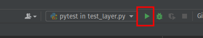
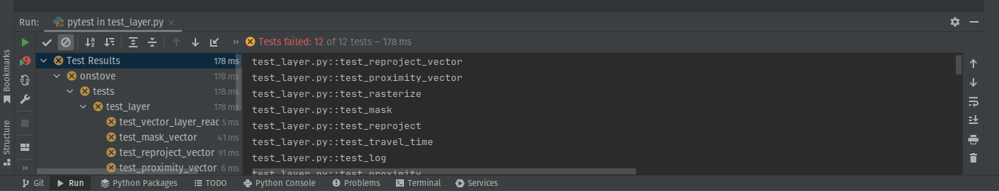
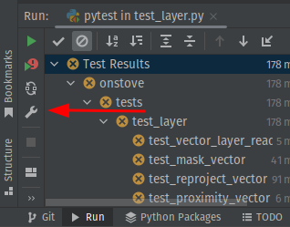
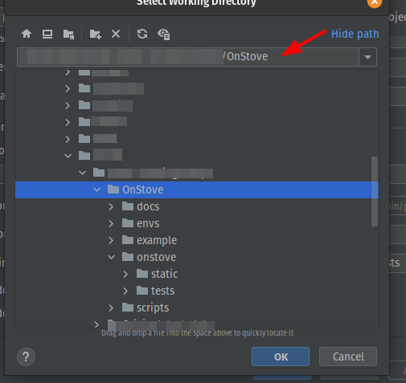
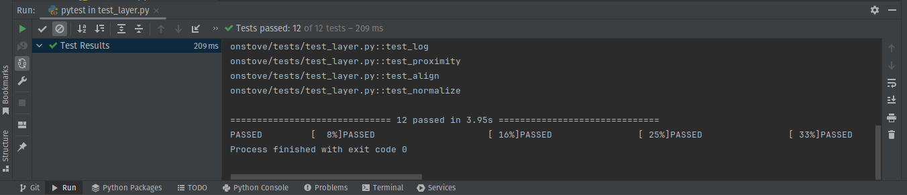

# Tests Onstove

## Setting up

For testing, use the testing environment. Which is set up by creating a new `env` using `conda`. The environment variables are defined in the `environment-tests.yml` file. The file is in the root directory.

```bash
$ conda env create -f environment-tests.yml
```
The key package for the testing environment is `pytest`. For more information about pytest, look at the [documentation](https://docs.pytest.org/en/7.4.x/contents.html).
The tests cover the main modules of the package which are:
- [layer.py](../layer.py)
- [model.py](../model.py)
- [raster.py](../raster.py)
- [technology.py](../technology.py)

## Creating tests

Requirements:
- The tests need to be in the `tests` directory.
- Each module has its own test module.
- The naming convention when working `pytest` is that each test file name must start with `test`.
Example: `test_layer.py`.
- The same is done for the test functions. Example: `test_vector_read_layer()`.

Test example(`test_layer.py`):

For more information on fixtures follow pytest documentation on [fixtures](https://docs.pytest.org/en/7.4.x/how-to/fixtures.html).

```python
# test for layer.py module
import os
import pytest
from onstove.layer import VectorLayer


@pytest.fixture
def vector_layer():
    # Create a VectorLayer object
    vect = VectorLayer()
    return vect


def test_vector_read_layer(vector_layer):
    vect_path = os.path.join(
        "onstove",
        "tests",
        "tests_data",
        "vector.geojson"
    )
    vector_layer.read_layer(path=vect_path)
    assert len(vector_layer.data) > 0
    assert isinstance(vector_layer, VectorLayer)
```

## Running tests

To run the tests you can open the terminal/Conda shell and enter:
```bash
$ pytest
```

This will run all tests present in the tests directory.

To run a particular test use:
```bash
$ pytest tests/test_layer.py
```

To set up automated testing in Pycharm while working, first of all:

- Run the test.
  - 

- It will display the results:
  - All tests will fail at first as the path is not well configured.
  - 

- Configure path :
  - 

- Set the path the root directory then save:
  - 

- To rerun the tests automatically after every change:
  - Click the icon as shown below to toggle it on.
  - 

- Run the tests again to activate automatic rerun.
  - 

