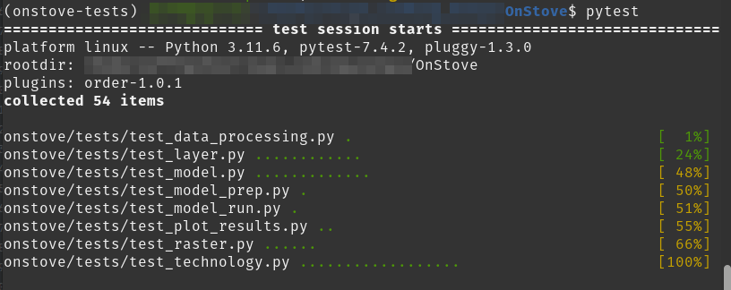

# Tests Onstove

## Setting up

For testing, use the testing environment. Which is set up by creating a new `env` using `conda`. The environment variables are defined in the `environment-tests.yml` file. The file is in the root directory.

```bash
$ conda env create -f environment-tests.yml
```
The key package for the testing environment is `pytest`. For more information about pytest, look at the [documentation](https://docs.pytest.org/en/7.4.x/contents.html).
The tests cover the main modules of the package which are:
- [layer.py](../layer.py)
- [model.py](../model.py)
- [raster.py](../raster.py)
- [technology.py](../technology.py)

## Creating Functional Tests

The project includes functional tests to ensure the correctness of specific functionalities.
These tests are designed to validate that our functions return the desired output.

To create functional tests, follow these guidelines:

1. Identify the Functionality:
   - Determine the specific functionality or feature you want to test.
   - Clearly define the input, expected behavior, and possible edge cases.
2. Write Test Cases: 
   - Create test cases that cover different scenarios related to the identified functionality.
   - Each test case should be independent and test a specific aspect of the functionality.
3. Use Descriptive Names:
   - Give meaningful names to your test cases.
   - A descriptive name makes it easier to understand what the test is checking.
   ```python
   def test_read_layer():
    ...
   ```
4. Provide Context:
   - Add comments or docstrings to your test cases, explaining the purpose of the test, the inputs being used, and the expected outcomes.
   ```python
   def test_read_layer(vector_object):
        """
        Test read vector layer.
        """
        vector_object.read_layer()
        ...
   ```

5. Use Assertions:
   - Include assertions to verify the expected outcomes of the functionality being tested.
   - If an assertion fails, the test will indicate a problem with the code.

Requirements:
- The tests need to be in the `tests` directory.
- Each module has its own test module.
- The naming convention when working `pytest` is that each test file name must start with `test`.
Example: `test_layer.py`.
- The same is done for the test functions. Example: `test_read_layer()`.
- Use fixtures. For more information on fixtures follow pytest documentation on [fixtures](https://docs.pytest.org/en/7.4.x/how-to/fixtures.html).

Test example(`test_layer.py`):

```python
# test for layer.py module
import os
import pytest
from onstove.layer import VectorLayer


@pytest.fixture
def vector_object():
    # Create a VectorLayer object
    vector = VectorLayer()
    return vector


def test_read_layer(vector_object):
    vect_path = os.path.join(
        "onstove",
        "tests",
        "tests_data",
        "vector.geojson"
    )
    vector_object.read_layer(path=vect_path)
    assert vector_object.data is not None
    assert isinstance(vector_object, VectorLayer)
```

## Running tests

To run the tests you can open the terminal/Conda shell and enter:
```bash
$ pytest
```

This will run all tests present in the tests directory.



To run a particular test use:
```bash
$ pytest tests/test_layer.py
```

To set up automated testing in Pycharm while working, first of all:

- Run the test.


- It will display the results:
  - All tests will fail at first as the path is not well configured.
  


- Configure path :


- Set the path the root directory then save:


- To rerun the tests automatically after every change:
  - Click the icon as shown below to toggle it on.


- Run the tests again to activate automatic rerun.


